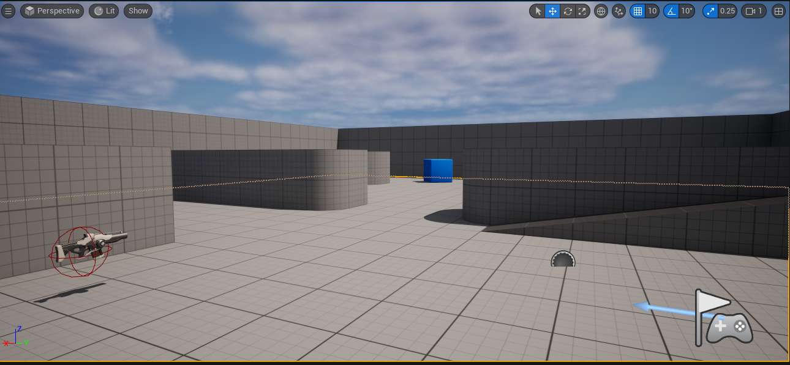
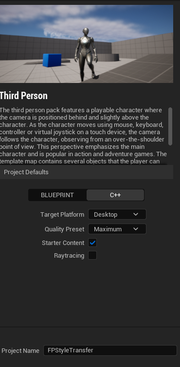

# Onxx runtime in Unreal Engine 5

## Preface

### What is Onxx (Open Neural Network Exchange)

> ONNX is an open format built to represent machine learning models. ONNX defines a common set of operators - the building blocks of machine learning and deep learning models - and a common file format to enable AI developers to use models with a variety of frameworks, tools, runtimes, and compilers. - [ONNX \| Home](https://onnx.ai/)

### What is Onxx Runtime

> ONNX Runtime is an open source project that is designed to accelerate machine learning across a wide range of frameworks, operating systems, and hardware platforms. It enables acceleration of machine learning inferencing across all of your deployment targets using a single set of API. ONNX Runtime automatically parses through your model to identify optimization opportunities and provides access to the best hardware acceleration available. - [ONNX Runtime \| About](https://onnxruntime.ai/about.html)

In short - Onxx is a cross-platform format (built by Microsoft) for ML models which can be converted from existing ML frameworks (e.g. ScikitLearn, Pytorch, Keras, etc.). ML models in Onxx format can be run on the *Onxx Runtime* which can be implemented on many platforms (Windows, Linux, Mac, etc.) and supports API in multiple languages (C++, C#, Java, Python, .etc.). *Onxx* is advertised to be more performant in inferencing (17x faster) and faster in training (1.4x faster).

## Onxx Runtime - Unreal Engine

Starts from *Unreal Engine 5*, the support for Neural Network Inferences running on Onxx Runtime are available. With this, game developers can implement existing ML models (from [Onxx model zoo](https://github.com/onnx/models)), or newly trained ML model (either directly in Onxx format or converted from other frameworks). With Onxx `C++` API, developers can easily integrate ML models with Unreal Engine source code and utilize their powerful - cutting edge technology into the game.

## Goal

This tutorial will follow a live demo of [Introduction to Deep Learning Models in Unreal - Events \| Microsoft Learn](https://learn.microsoft.com/en-us/events/mixed-reality-dev-days/introduction-to-deep-learning-models-in-unreal)
\> Source project: [microsoft/OnnxRuntime-UnrealEngine: Apply a Style Transfer Neural Network in real time with Unreal Engine 5 leveraging ONNX Runtime. (github.com)](https://github.com/microsoft/OnnxRuntime-UnrealEngine)

At the end of this tutorial, you will be able to apply a post-processing Deep Learning model that style transfers your viewport.

*Before:*

*After*:


## Setting up
1. Launch `Unreal Engine 5.2` from `Epic launcher`
2. Choose `C++` from `Project Defaults`, name the project as your liking. For this tutorial, I will name it `FPStyleTransfer`

   
3. In the `Unreal Editor`, navigate to `Edit -> Plugins` and enable the following plugins:
   1. *Neural Network Inference (NNI)* - Enabling the availability of ML inferences running on Onxx runtime
   
   2. *OpenCV* - Enabling this allows the availability of OpenCV library for image processing, harmonizing the usage with Computer Vision ML models
   
   3. Your `<ProjectName>.uproject` file should list the added plugins
    ```python {linenos=table,caption="FPStyleTransfer.uproject"}
    
    "Plugins": [
            {
                "Name": "NeuralNetworkInference",
                "Enabled": true
            },
            {
                "Name": "OpenCV",
                "Enabled": true
            },
            ...
        ]
    ```
